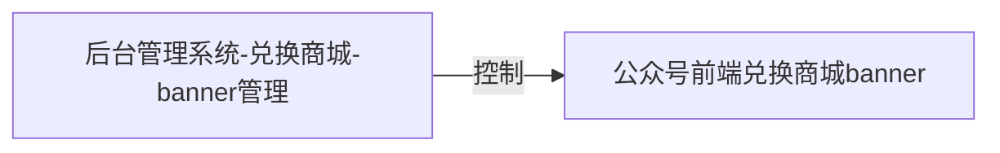
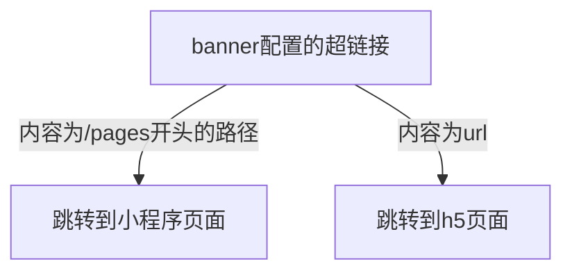
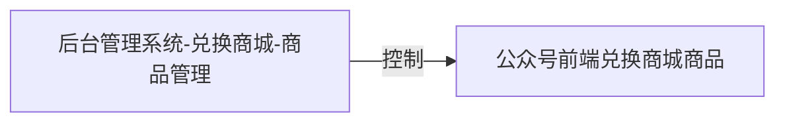
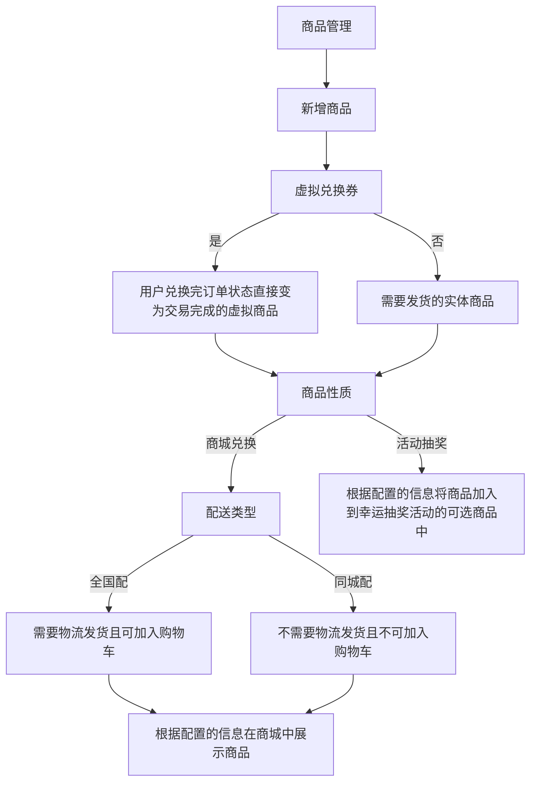
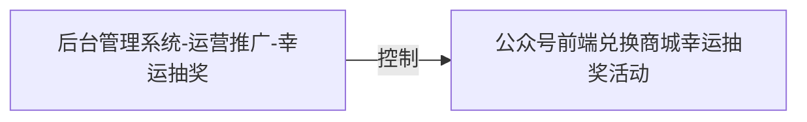
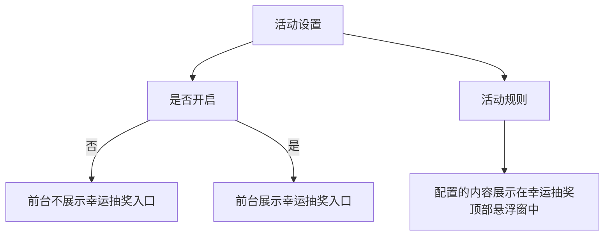
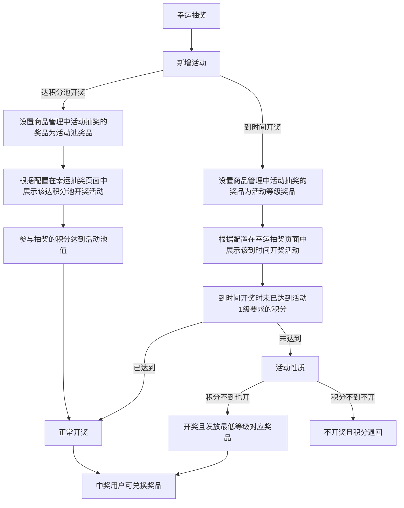
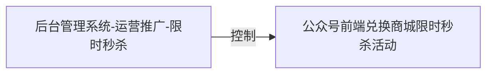
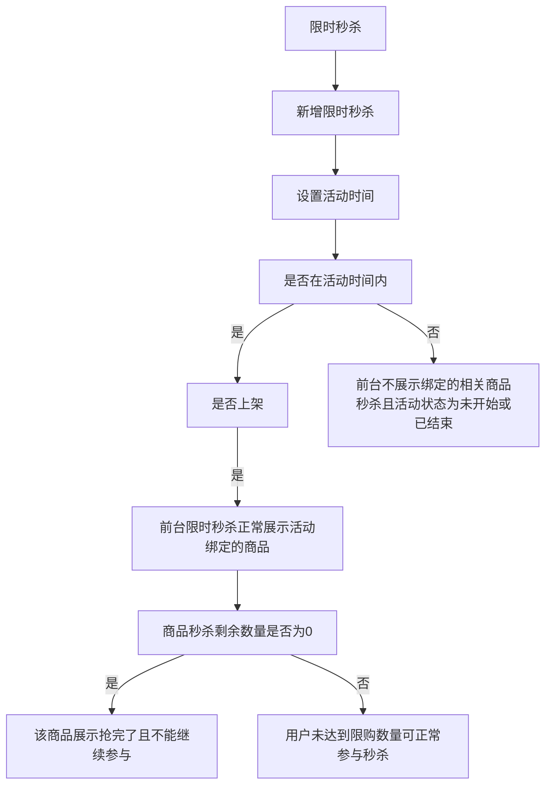
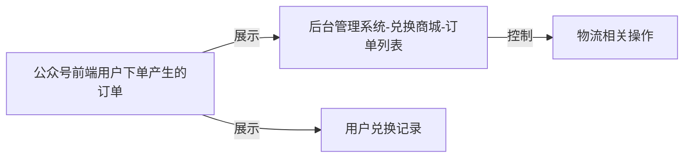

## 泰啤兑换商城

### 一、泰啤兑换商城后台管理系统

#### 1.目录分析

| 目录名称                                                           | 作用                                   |
| :------------------------------------------------------------- | :----------------------------------- |
| build                                                          | 存放npm run preview执行的文件，查看体积分析报告，构建相关 |
| dist                                                           | 打包后的静态文件                             |
| node\_modules                                                  | 依赖文件                                 |
| public                                                         | vue项目公共文件                            |
| src                                                            | 存放vue项目代码                            |
| static                                                         | 存放图片/图标/字体/插件等公共静态文件                 |
| vue.config.js                                                  | vue项目配置文件                            |
| .env.xxxxx,.eslintxxxx,.gitignore,babel.config.js,package.json | 环境配置，git配置，eslint配置等                 |

#### &#x20;2.代码文件结构分析

```
│  App.vue               // 项目的主组件，页面入口文件
│  main.js               // 项目的入口文件，加载组件，初始化等
│  permission.js         // 权限管理
│  settings.js           // 系统配置
│
├─api                    // 请求存放位置
├─assets                 // 主题，样式，图片等静态资源
├─components             // 全局公用组件
│  ├─Breadcrumb          // 面包屑
│  ├─Editor              // 编辑器组件（未使用）
│  ├─Hamburger           // 导航栏展开收起按钮
│  ├─HeaderSearch        // 顶部搜索（未使用）
│  ├─IconSelect          // 菜单图标选择
│  ├─myEditor            // 富文本编辑器
│  ├─Pagination          // 分页器
│  ├─PanThumb            // 未使用的组件
│  ├─RightPanel          // 右侧抽屉（未使用）
│  ├─RightToolbar        // 右侧工具栏 （未使用）
│  ├─RuoYi               // ruoyi相关组件 （未使用且不需要的组件）
│  ├─Screenfull          // 全屏 （未使用）
│  ├─searchBar           // 筛选 （在测试账号taipi中未查询到使用的组件）
│  ├─SizeSelect          // 布局选择（未使用)
│  ├─SvgIcon             // 加载svg图标
│  └─ThemePicker         // 主题选择（未使用)
│
├─directive              // 全局自定义弹窗拖拽指令（未使用)
├─layout                 // 布局
│  │  index.vue          // 布局总组件
│  │
│  ├─components          // 布局子组件
│  │  │  AppMain.vue     // 页面主体容器
│  │  │  index.js        // 组件方法，用于引入子组件
│  │  │  Navbar.vue      // 上方导航栏
│  │  │
│  │  ├─Settings         // 设置组件（未使用）
│  │  ├─Sidebar          //侧边栏
│  │  └─TagsView         // 标签组件（未使用)
│  │
│  └─mixin               // 监听窗口变化的通用方法
│
├─router                 // 路由目录
├─store                  // vuex目录
├─utils                  // 全局工具方法
│  │  auth.js            // 存储token
│  │  cryptoJS.js        // cryptoJS加密
│  │  errorCode.js       // 错误码对应的错误信息
│  │  filters.js         // 未使用的金额转换方法
│  │  index.js           // ruoyi框架封装的全局方法，包含时间格式化，获取url的param，json转换为param，param转换为对象等
│  │  jsencrypt.js       // 密码加解密方法
│  │  permission.js      // 未使用的权限校验
│  │  request.js         // axios拦截器
│  │  ruoyi.js           // ruoyi框架封装的全局方法，包含日期格式化，通用下载方法，字符串格式化，构造树型结构数据等
│  │  scroll-to.js       // 封装的滚动条滚动方法
│  │  validate.js        // 正则校验集合
│  │  zipdownload.js     // 压缩解析blob响应内容并下载
│  │
│  └─generator           // 此目录下为表单配置代码生成组件的工具，该项目未使用
│
└─views
    │  index.vue         // 首页
    │  login.vue         // 登录页
    │  loginOld.vue      // 废弃未删除的登录页
    │  redirect.vue      // 当设置 noRedirect 的时候该路由在面包屑导航中不可被点击，但本项目未使用面包屑，该路由无用途
    │  welcome.vue       // 未使用的欢迎页
    │
    ├─alliance           // 在测试账号taipi中未查询到使用的路由
    ├─charts             // 在测试账号taipi中未查询到使用的路由
    │
    ├─components
    │  │  uploadImg.vue  // 图片上传组件
    │  │
    │  ├─dragEle         // 在测试账号taipi中未查询到使用的拖拽组件
    │  └─icons           // icon组件（未使用）
    │
    ├─dashboard          // 在测试账号taipi中未查询到使用的路由
    │  └─mixins          // 图表的通用mixin
    │
    ├─drainage           // 在测试账号taipi中未查询到使用的路由
    │
    ├─error              // 错误页
    │      401.vue
    │      404.vue
    │
    ├─mall               // 兑换商城
    │  ├─banner          // banner管理
    │  ├─goods           // 商品管理
    │  ├─order           // 订单列表
    │  └─us              // 联系我们
    │
    ├─monitor            // 指标监控
    │  ├─chats           // 数据页
    │  ├─druid           // 在测试账号taipi中未查询到使用的路由
    │  ├─job             // 调度日记（使用了但无接口的公共路由）
    │  ├─logininfor      // 在测试账号taipi中未查询到使用的路由
    │  ├─online          // 在测试账号taipi中未查询到使用的路由
    │  ├─operlog         // 在测试账号taipi中未查询到使用的路由
    │  └─server          // 在测试账号taipi中未查询到使用的路由
    │
    ├─operating          // 运营推广
    │  ├─luckydraw       // 幸运抽奖
    │  └─seckill         // 限时秒杀
    │
    ├─redpacket          // 在测试账号taipi中未查询到使用的路由
    ├─risk               // 在测试账号taipi中未查询到使用的路由
    ├─system             // 在测试账号taipi中未查询到使用的路由
    ├─tool               // 在测试账号taipi中未查询到使用的路由
    ├─wallet             // 在测试账号taipi中未查询到使用的路由
    └─withdraw           // 在测试账号taipi中未查询到使用的路由

```

#### 3.代码全局变量分析

**3.1 vue的全局方法挂载**

```javascript
// vue的全局方法挂载
Vue.prototype.getDicts = getDicts // 根据字典类型查询字典数据信息的接口
Vue.prototype.getConfigKey = getConfigKey // 根据参数键名查询参数值的接口
Vue.prototype.parseTime = parseTime // 日期格式化方法
Vue.prototype.resetForm = resetForm // elementUI表单重置方法封装
Vue.prototype.addDateRange = addDateRange // 添加日期范围
Vue.prototype.selectDictLabel = selectDictLabel // 回显数据字典
Vue.prototype.selectDictLabels = selectDictLabels // 回显数据字典（字符串数组）
Vue.prototype.download = download // 通用下载方法
Vue.prototype.handleTree = handleTree // 构造树型结构数据

// 成功提示
Vue.prototype.msgSuccess = function (msg) {
  this.$message({ showClose: true, message: msg, type: "success" });
}
// 错误提示
Vue.prototype.msgError = function (msg) {
  this.$message({ showClose: true, message: msg, type: "error" });
}
// 普通信息提示
Vue.prototype.msgInfo = function (msg) {
  this.$message.info(msg);
} 
```

**3.2 Vuex中的全局变量（其中tagsView\.js，settings.js的内容未使用，不进行分析）**

| 变量名         | 含义          | 修改的方法                          |
| :---------- | :---------- | :----------------------------- |
| token       | 登录令牌        | SET\_TOKEN                     |
| name        | 用户名         | SET\_NAME                      |
| avatar      | 用户头像        | SET\_AVATAR                    |
| userMsg     | 用户信息        | SET\_USER                      |
| roles       | 用户角色        | SET\_ROLES                     |
| permissions | 用户权限        | SET\_PERMISSIONS               |
| hasHome     | 是否展示首页      | permission.js中SET\_ROUTES时进行设置 |
| routes      | 路由列表        | SET\_ROUTES                    |
| addRoutes   | 根据权限返回的路由列表 | SET\_ROUTES                    |

#### 4.代码优化分析

*   存在较多使用框架时自带的未使用的全局组件未删除，如RightToolbar，searchBar。
*   部分单文件组件命名不符合大驼峰/短横线规范，混用文件命名方式会导致大小写不敏感的文件系统问题。
*   存在较多因使用框架或复制粘贴冗余代码，且在Vue2项目未使用相关的webpack代码压缩，可能导致打包时间延长。
*   后台项目基本都存在eslint检测出的display\:box的警告，dispaly\:box为2009年的语法，目前已被display\:flex所取代。
*   配置webpack相关优化插件，去除打包后的console.log，压缩文件提高运行效率。
*   存在大量相同逻辑和功能的组件可提取到mixin，简洁代码空间，但mixin的变量来源不明确，不利于阅读，使代码变得难以维护，更建议在后续项目中使用vue3的自定义hooks。
*   类名命名重复，存在深层嵌套难以维护的问题，建议使用BEM命名规范，保持类名的低特异性和一致性，便于编写时的阅读和维护。
*   全局组件文件夹可以设置为懒加载，无需引入，且存在两个重复的全局组件文件夹。

#### 5.代码模块分析

| 模块名称                              | 作用                 | 引入方式       |
| :-------------------------------- | :----------------- | :--------- |
| js-cookie                         | 轻量级处理cookies的插件    | 引入全局依赖     |
| normalize.css                     | 重置各端浏览器标签的默认值      | 引入全局依赖     |
| element-ui+element-variables.scss | element-ui组件库      | 引入全局依赖     |
| element-variables.scss            | elementUI主题色       | 定义静态文件全局引入 |
| index.scss，ruoyi.scss             | 全局通用样式或布局          | 定义静态文件全局引入 |
| permission                        | 权限校验               | 封装方法后全局引入  |
| ruoyi                             | ruoyi框架封装的一系列js工具库 | 封装方法后全局引入  |
| Pagination                        | 全局分页组件             | 全局引入挂载     |
| filters                           | filters过滤器         | 封装方法后全局引入  |
| Clipboard                         | 复制粘贴插件             | 引入全局依赖     |

### 二、泰啤公众号前端

#### 1.目录分析

| 目录名称                                                           | 作用                   |
| :------------------------------------------------------------- | :------------------- |
| dist                                                           | 打包后的静态文件             |
| node\_modules                                                  | 依赖文件                 |
| public                                                         | vue项目公共文件            |
| src                                                            | 存放vue项目代码            |
| vue.config.js                                                  | vue项目配置文件            |
| .env.xxxxx,.eslintxxxx,.gitignore,babel.config.js,package.json | 环境配置，git配置，eslint配置等 |

#### 2.代码文件结构分析

    │  App.vue               // 项目的主组件，页面入口文件
    │  config.js             // 项目配置文件
    │  oceans.js             // 一个空文件
    │  main.js               // 项目的入口文件，加载组件，初始化等
    │  settings.js           // 系统配置
    ├─assets                 // 静态文件
    │
    ├─components             // 公共组件
    │  ├─oAddressCard        // 地址组件
    │  ├─oButton             // 按钮组件
    │  ├─ocon                // 在内容前插入icon的组件
    │  ├─oPayBox             // 静态文件
    │  ├─oQrcode             // 支付密码组件
    │  ├─oRefresh            // 刷新组件
    │  └─oToast              // 弹出层组件
    │
    ├─icons                  // icon组件
    ├─mint-ui                // mint-ui按需引入
    ├─mock                   // mock插件模拟数据（未使用)
    ├─muse-ui                // muse-ui按需引入
    ├─program                // 项目文件
    │  └─smalltiger          // 项目目录
    │      ├─api             // 接口数据存放
    │      ├─components      // 公共组件
    │      ├─config          // 配置文件
    │      ├─routers         // 路由配置文件
    │      ├─static          // 静态文件
    │      └─views           // 页面
    ├─router                 // 路由配置
    ├─store                  // vuex配置
    ├─tools                  // 工具封装
    └─vant-ui                // vant-ui按需引入

#### 3.代码全局变量分析

**3.1 vue的全局方法挂载**

```javascript
// bus通讯工具 隔代组件通讯工具
Vue.prototype.bus = Bus
// echarts
Vue.prototype.$echarts = echarts
// 公共函数：页面跳转，缓存设置，复制内容，格式化时间，webSocket，获取url参数等
Vue.prototype.base = o_base
// 未使用的全局变量
Vue.prototype.$vConsole = new Vconsole()
Vue.config.productionTip = false

Vue.prototype.toast = oToast; //给Vue对象添加toast方法
Vue.prototype.alert = oAlert; //给Vue对象添加alert方法
Vue.prototype.xToast = xToast; //给Vue对象添加Xtoast方法
Vue.prototype.confirm = oConfirm; //给Vue对象添加confirm方法
Vue.prototype.showLoading = oShowLoading; //给Vue对象添加loading方法
Vue.prototype.hideLoading = oHideLoading; //给Vue对象添加hideLoading方法
// 微信sdk
Vue.prototype.wechat = wechat;
```

**3.2 Vuex中的全局变量**

| 变量名          | 含义        | 修改的方法               |
| :----------- | :-------- | :------------------ |
| loginStatus  | 登陆状态      | SET\_LOGIN\_STATUS  |
| token        | 登录令牌      | SET\_TOKEN          |
| userInfo     | 用户信息      | SET\_USERINFO       |
| tabbarStatus | tabbar的状态 | SET\_TABBAR\_STATUS |
| wallet       | 钱包信息      | SET\_WALLET         |

#### 4.代码优化分析

*   src目录下的program下的目录重复嵌套且没有实际含义，猜测一开始是目的是为了后续将不同的项目区分开，但是实际开发时还是混合编写了，因此可以将program下的smalltiger中的内容放置在src目录下，避免重复嵌套开发项目增加维护难度。
*   单文件组件命名建议使用大驼峰/短横线规范，混用文件命名方式会导致大小写不敏感的文件系统问题。
*   vuex中的mutationTypes拆分为变量的意义不明确。
*   类名命名重复，存在深层嵌套难以维护的问题，建议使用BEM命名规范，保持类名的低特异性和一致性，便于编写时的阅读和维护。
*   按需引入的多个ui框架可以合并到同一个ui文件中。
*   存在未使用的全局变量或已引入挂在的全局变量重复引入，存在部分无效未删除或功能重复的文件和依赖。
*   配置webpack去除打包后的控制台信息。

#### 5.代码模块分析

| 模块名称                      | 作用                        | 引入方式                 |
| :------------------------ | :------------------------ | :------------------- |
| component                 | 外部的全局组件                   | 全局引入挂载               |
| stCom                     | program下的smalltiger中的公共组件 | 全局引入挂载               |
| echarts                   | echarts图表组件               | 引入全局依赖               |
| Bus                       | 组件通讯工具                    | 封装方法后全局引入            |
| o\_base.less，iconfont.css | 全局通用样式，字体图标               | 定义静态文件全局引入           |
| rem.js                    | rem布局计算文件                 | 封装方法后全局引入            |
| swiper                    | 滑动模块                      | 引入全局依赖               |
| wx                        | 微信sdk                     | 封装方法后引入到公共函数o\_base中 |
| filters                   | filters过滤器                | 封装方法后全局引入（未使用的内容）    |
| Clipboard                 | 复制粘贴插件                    | 引入全局依赖               |
| authority                 | 权限校验                      | 封装方法后全局引入            |
| tools                     | 全局工具方法                    | 封装方法后全局引入            |
| wechatAuth                | 微信登录授权                    | 封装方法后全局引入            |
| shop                      | shop项目中的公共方法              | 封装为mixin后引入          |

### 三、业务流程分析

1.banner






2.商品管理





3.幸运抽奖








4.限时秒杀





5.订单



```mermaid
flowchart 
幸运抽奖兑换商品 --> 生成订单到订单列表
参与限时秒杀 --> 生成订单到订单列表
普通兑换商品 --> 生成订单到订单列表
生成订单到订单列表 --> 全国配
全国配--> 同步状态
同步状态 --> 同步成功--> 订单状态为已发货
同步状态 --> 同步失败--> 是否手动发货 --是--> 订单状态为已发货
同步成功 --取消圆通订单--> 取消同步
同步状态 --> 取消同步--> 是否手动发货
是否手动发货 --否--> 订单状态为待发货
订单状态为已发货 --> 可修改物流单号
订单状态为已发货 --> 用户确认收货 --> 订单状态为交易完成


生成订单到订单列表 --> 同城配 --> 配送类型 --送货上门 --> 是否已接单 --否--> 订单状态为待接单
是否已接单 --是--> 订单状态为待配送 --用户确认收货--> 订单状态为交易完成
订单状态为待接单 --> 门店是否接单 --是--> 订单状态为待配送
门店是否接单 --否--> 订单状态为已拒单
配送类型 --自提 --> 是否已自提 --是--> 订单状态为交易完成
是否已接单 --否--> 订单状态为待自提 --用户根据券码自提 --用户确认收货--> 订单状态为交易完成
```
